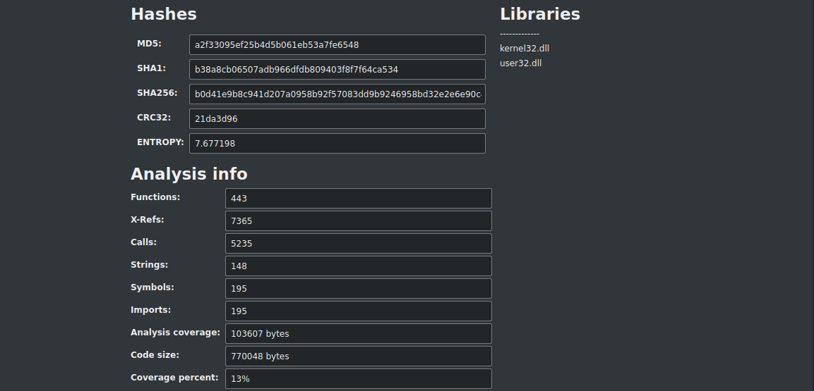
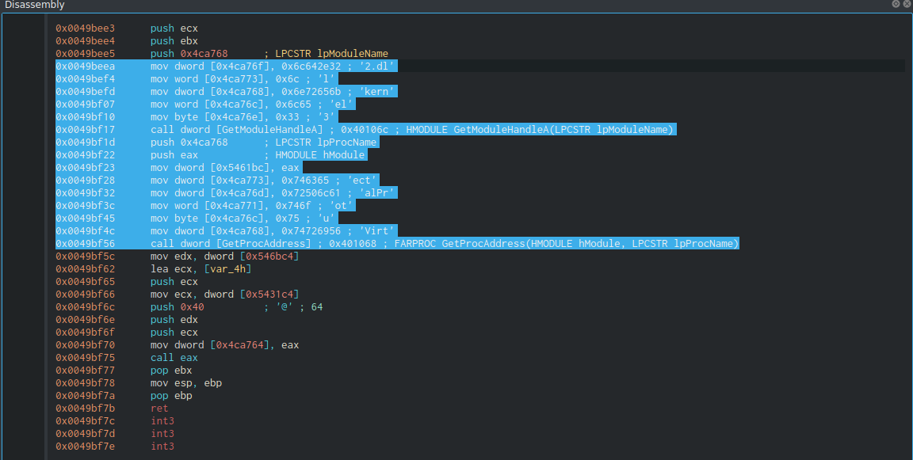
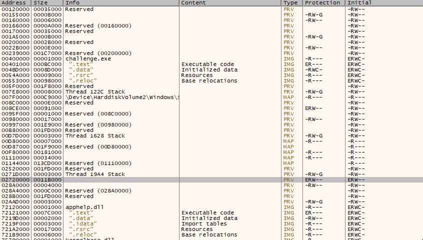
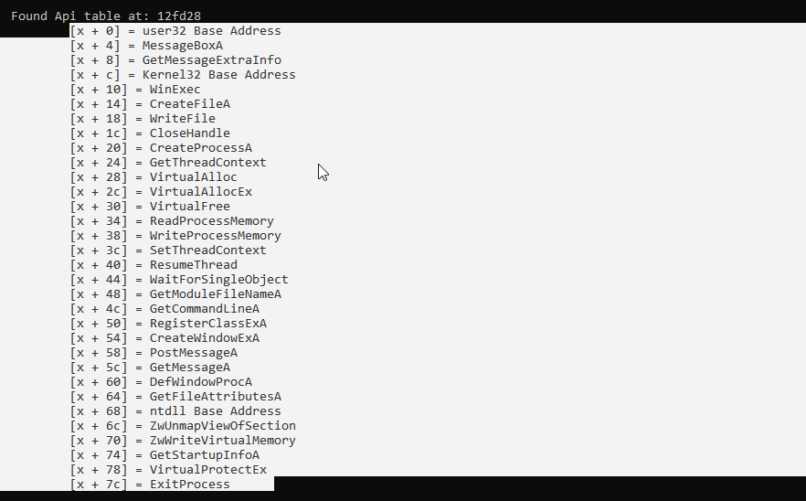
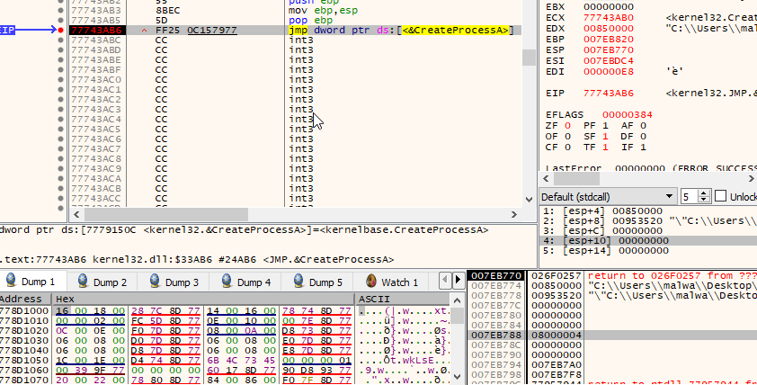

# Discription:

	After a successful breach, the SOC team extracted some files from the traffic here is the main suspicious one for analysis.

# Overview:

looking at sections we notice 4 sections and the entropy is very high in ".text" section.

By searching a bit we noticed that the malware tries to hide some API calls and uses a technique called "stack strings" which is the use of a stack to resolve the name of the API 

here we see that the malware is resolving the API "virtualprotect" from "Kernel32" 

now it's time to load the malware into a debugger so I loaded it into "x32dbg" and added a breakpoint at the end of the call to "virtualalloc" where the eax register will hold the pointer to the region created.

by examining it in the memory map view we see that it has the protection "ERW"

which may be interesting to dump for analysis.

after dumping it I used "scdbg" against the shellcode and found that it resolves these dlls

we also can notice that the malware uses API "createprocess" with the flag "0x04" to create a new process in a suspended mode which lead us to think that the attacker uses a process injection technique called "process hollowing" 

For more about process hollowing
 https://attack.mitre.org/techniques/T1055/012/

